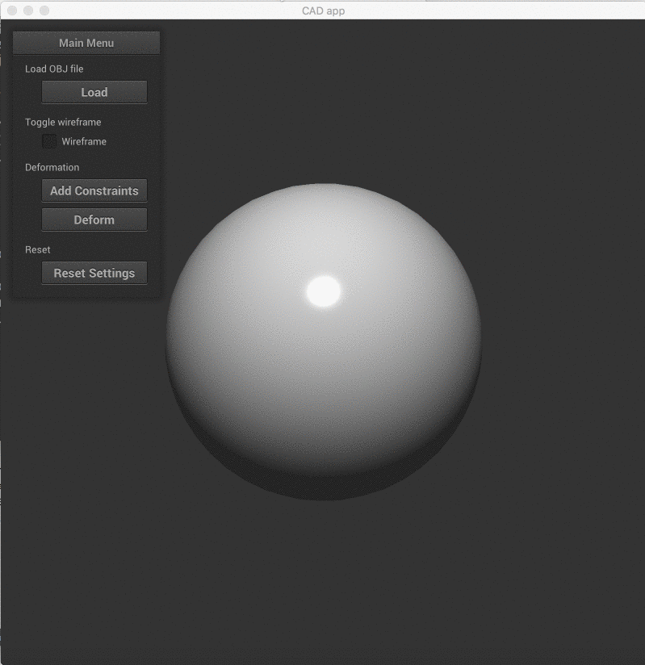

# CSCI-5229 Project: CAD App
Simple 3D CAD Design Tool: https://github.com/ryosuzuki/cad-app

Ryo Suzuki
ryo.suzuki@colorado.edu

# Demo 
See `demo-sphere.gif` and `demo-armadillo.gif` for the quick demo.



# How to compile

For Linux (Ubuntu) users, you should first install dependencies. (Tested with Ubuntu 16.04 LTS)

```
$ sudo apt-get install cmake xorg-dev libglu1-mesa-dev
```

Then, build with `CMake`

```
$ mkdir build
$ cd build
$ cmake ..
$ make
```

Run the application

```
$ ./cad-app
```

Stop the application with `ESC` key or `Ctrl-C` in the terminal.


# How to play

## 1. Basic functionality
### 1-1: Load the OBJ file 
Clicking the `Load` button, the file manager shows up. You can choose your own OBJ file from your local computer. 
There are some sample OBJ files that I tested (`sphere.obj`, `bunny.obj`, and `armadillo.obj`). 
As a default, the screen shows `data/sphere.obj`.

### 1-2: Control the camera
By dragging the mouse, you can control the camera. By scrolling, you can zoom in and out.
You can also change the camera position with arrow keys (up, down, left, right).

### 1-3: Toggle wireframe
After loading the OBJ file, you can change the wireframe by clicking the `wireframe` check button.

## 2. Mesh deformation 
### 2-1: Set the constraints
First you click the `Add Constraints` toggle switch. 
While `Add Constraints` button is on, you can select the face by clicking the mesh. 
The program highlights the constraint vertices as green color. 
You can still control the camera by dragging the background. 

### 2-2: Deformation by dragging the mouse
After adding constraints, now you can deform the mesh. 
Click the `Deform` button, then click the mouse on the mesh surface and drag the mouse. 
Now, you can see the mesh is deforming.
You can also control the camera by dragging the background. 

Note that the deformation algorithm works in real-time for the simple mesh such as `sphere.obj`, but the computation time will be longer and not be real-time for the dense mesh such as `armadillo.obj` (43K vertices and 86K faces) and `bunny.obj` (2K vertices and 5K faces).
It is one of the limitations, but can be improved.

# How it works 
## As-rigid-as-possible surface deformation
The deformation algorithm is basically based on this paper.  

"As-rigid-as-possible surface modeling.", Olga Sorkine and Marc Alexa., Symposium on Geometry processing. Vol. 4. 2007.
https://www.igl.ethz.ch/projects/ARAP/arap_web.pdf

The main goal of the algorithm is to solve the `Lp' = b` of the equation 9, where `L` is Laplacian matrix, p is deformed vertex positions, and `b` is a constraint vector.
First, when the OBJ file is loaded, `src/mesh.cpp` calculates Laplacian matrix with the symmetric cotangent weights.
Then, the program constructs `b` by letting the user add constraint vertices. 
The basic approach is to minimize the local rigidity energy described in the equation 7, so we iteratively compute the gradient of the energy function `E(S')` in `src/deform.cpp`. 
For the fast calculation to solve the linear equation `Lp' = b`, I used the Cholesky factorization by leveraging the sparse LU decomposition provided by the [Eigen](https://eigen.tuxfamily.org/) matrix library.

## Other functionalities 
`src/viewer.cpp` provides the basic 3D viewer and event callback. I used [GLFW](https://github.com/glfw/glfw) for the OpenGL utility library and [nanogui](https://github.com/wjakob/nanogui) for the basic UI components such as buttons and check-boxes (GLFW is already included in the nanogui library).  
`src/control.cpp` enables to rotate and zoom based on model, view, and projection matrix. 
`src/shader.cpp` and `shader_mesh.vert/geom/frag` are the shader files. 
`src/ray.cpp` is for the ray tracing, which enables to select the vertex and face by converting from the 2D mouse position to the 3D world. For the fast ray tracing, I used the Bounding Volume Hierarchy (BVH) algorithm introduced in this paper.

"Ray tracing deformable scenes using dynamic bounding volume hierarchies.", Ingo Wald, Solomon Boulos, and Peter Shirley.  ACM Transactions on Graphics (TOG) 26.1 (2007): 6.


